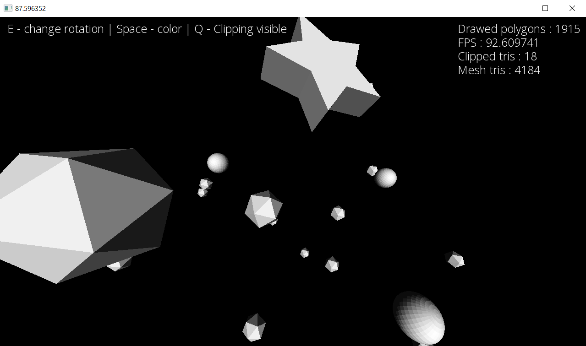
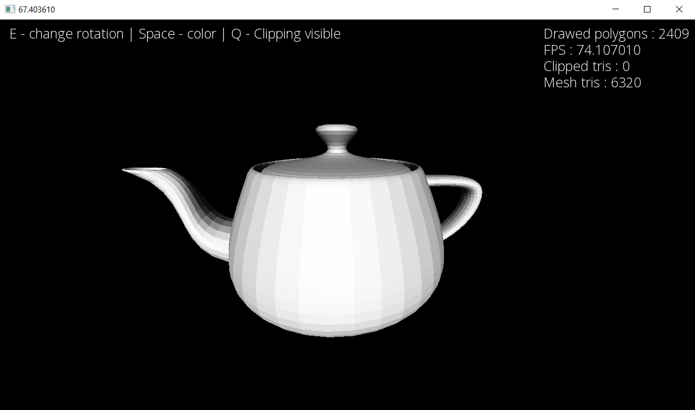
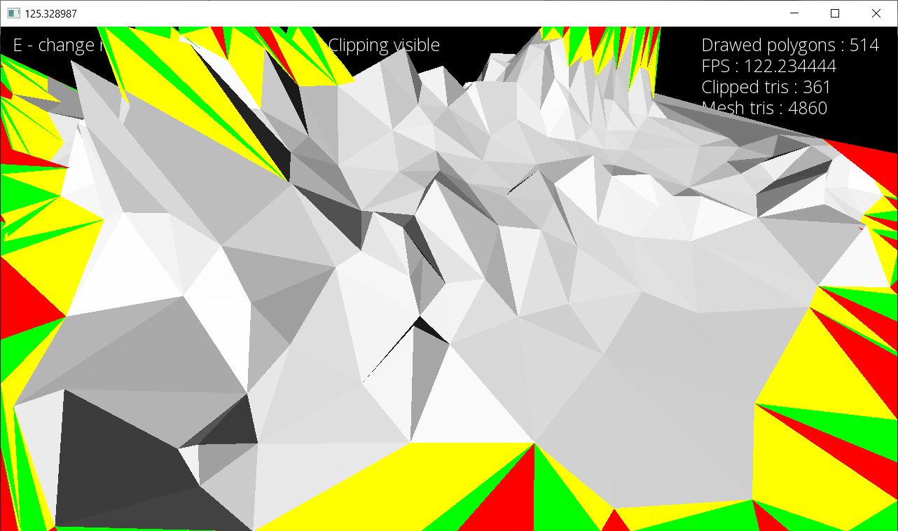

# 3d software renderer

    3D software renderer which allows to display 3d models form *.obj files with the simplest form of lighting
    I used SFML window and some of its conveniences to drawing triangles and lines.  
    Everything else is linear algebra.

# Description 
  
    Thanks a lot to javidx9 for excellent explanation of all mathematical things that i had 
    to learn before i stated. During this project i learned a lot about projection and
    matrix translations in 3d. 
    
    Features:
    * Simple lighting statically attached to the observer, illuminates polygons 
      depending on the angle between camera look_at vector and triangle_normal vector.
    * Clipping against window edges and fNear plane.
    * Working camera controlled by mouse.

# How to run it

    1. Run *.exe file in release folder

# ScreenShots

